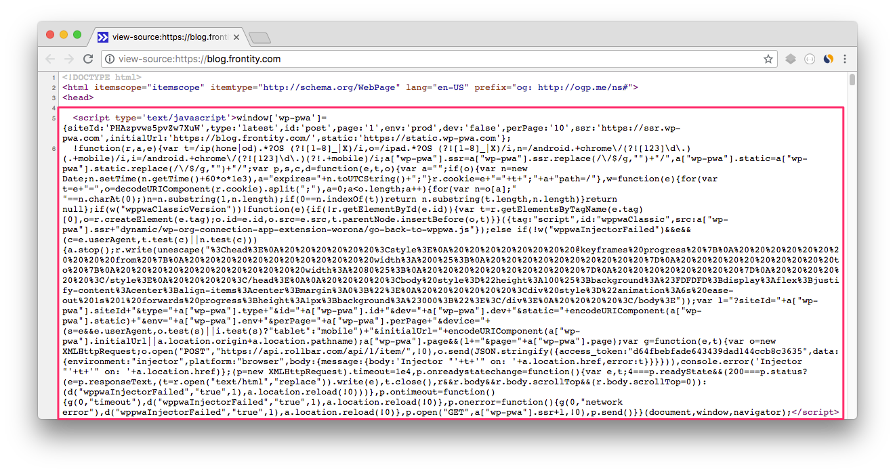
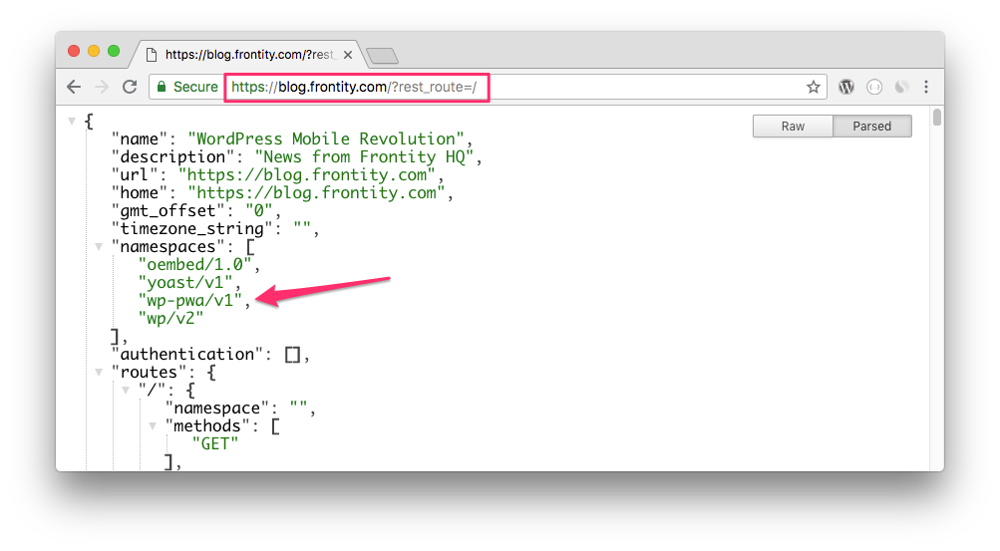
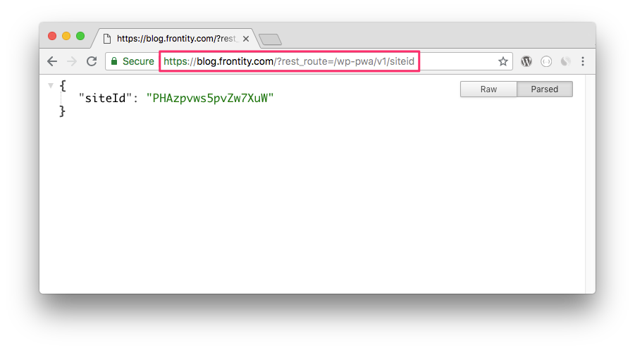

# How to check Frontity is properly installed

There are a few things you can do to check if you have completed the set-up process correctly.

## 1. Check if our injector is correctly included in your WordPress theme

* Go to your site.
* Right click where there is no text or images.
* Click `View Page Source`.
* You should see our script right after the `<head>` tag with no other scripts inserted before.

## 2. Check the WordPress PWA plugin is installed and activated

* Go to your site and add the query `?rest_route=/` to your URL.

  > Example: [https://blog.frontity.com/?rest\_route=/](https://blog.frontity.com/?rest_route=/)

* In `namespaces` you should see `"wp-pwa/v1"`.

## 3. Check if you entered a valid Site ID

* Go to your site and add the query `?rest_route=/wp-pwa/v1/siteid` to your URL.

  > Example: [https://blog.frontity.com/?rest\_route=/wp-pwa/v1/siteid](https://blog.frontity.com/?rest_route=/wp-pwa/v1/siteid)

* There you should see your Site ID.

If you're having any trouble installing Frontity, please get in touch. We'll be happy to help.

