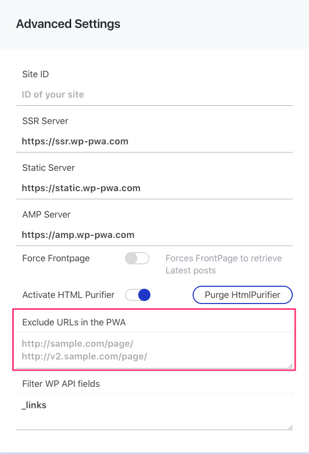

# Exclude URLs in the PWA

You can exclude a specific URL from being loaded into the PWA. This way, if visitors access that URL from a mobile browser, they will see the classic mobile version of your site instead of the PWA.

1. Go to the **Advanced Settings** screen of Frontity's plugin.

2. In the ****settings box, go to **Exclude URLs in the PWA** and **type or paste** the **URLs** that you want to exclude \(one per line\).


You can use regular expressions too.


3. Click **Save changes**. 

