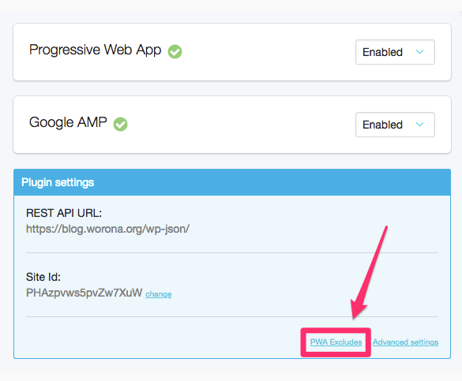
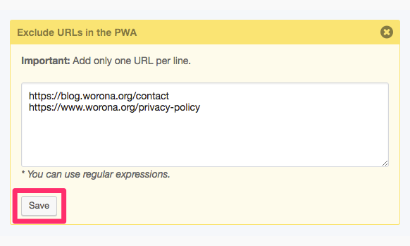

# Exclude URLs in the PWA

You can exclude a specific URL from being loaded into the PWA. This way, if visitors access that URL from a mobile browser, they will see the classic mobile version of your site instead of the PWA.

1. Go to the **PWA configuration** screen from your WordPress dashboard.

2. In the blue **Plugin settings** box, click the **PWA Excludes** link.

3. **Type or paste** the **URLs** you want to exclude \(one per line\).


You can use regular expressions too.


4. Click **Save**.

