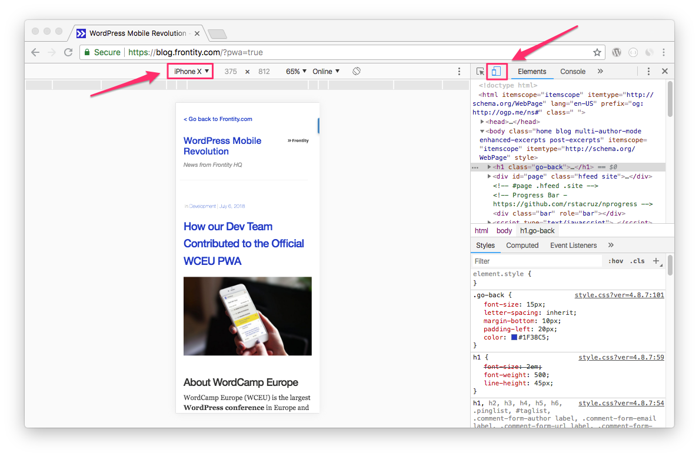
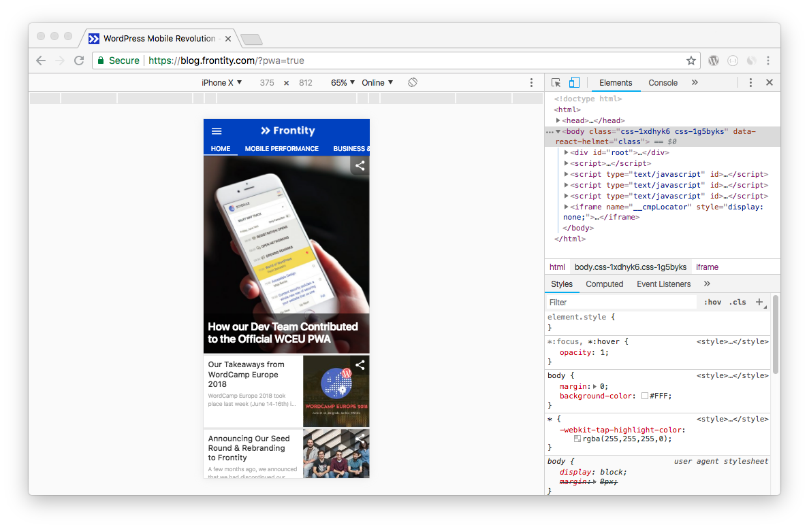

# How to preview your PWA

Once you have completed all the steps of our [installation guide](wp-pwa-plugin-installation.md) and the PWA is already configured, you can easily see what it looks like before activating it.

To do so, simply add the query `?pwa=true`to your WordPress site URL and visit it from a mobile browser.

> For example: [https://blog.frontity.com/?pwa=true](https://blog.frontity.com/?pwa=true).

**If you are on desktop in Chrome**, follow these steps:

* Go to your site URL with the query `?pwa=true` \([https://example.com/?pwa=true](https://example.com/?pwa=true)\).
* **Right click** your website where there is no text or images.
* Click **Inspect** and then the **Toggle device toolbar** icon in the top-left.
* Select a mobile device, such as the iPhone X.

* **Refresh** your browser to preview the PWA in the inspector view.

