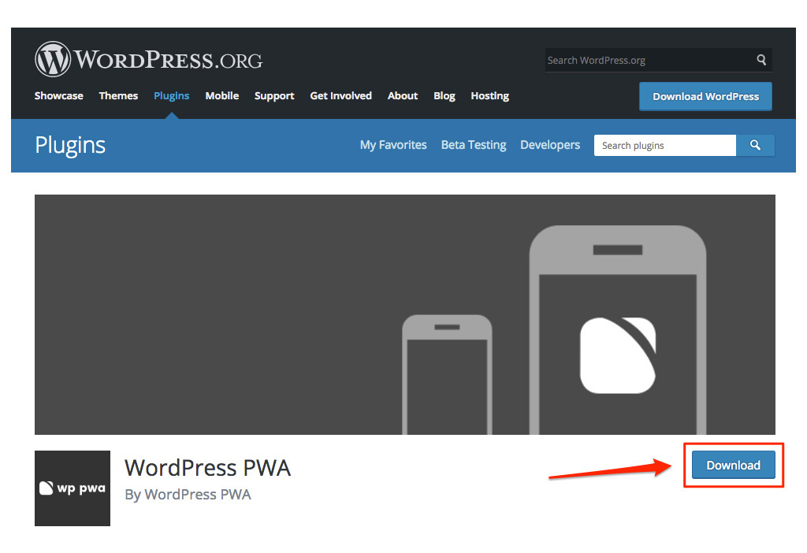
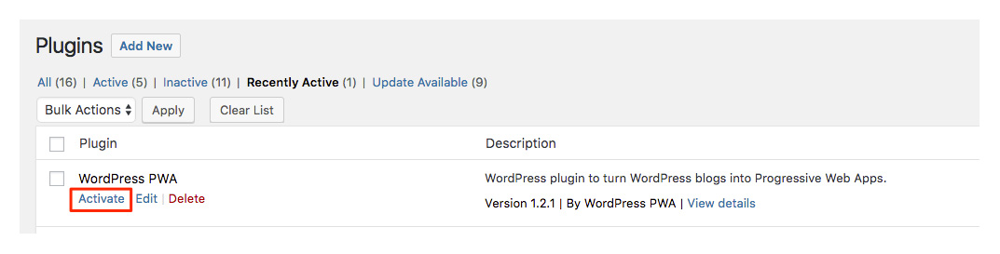
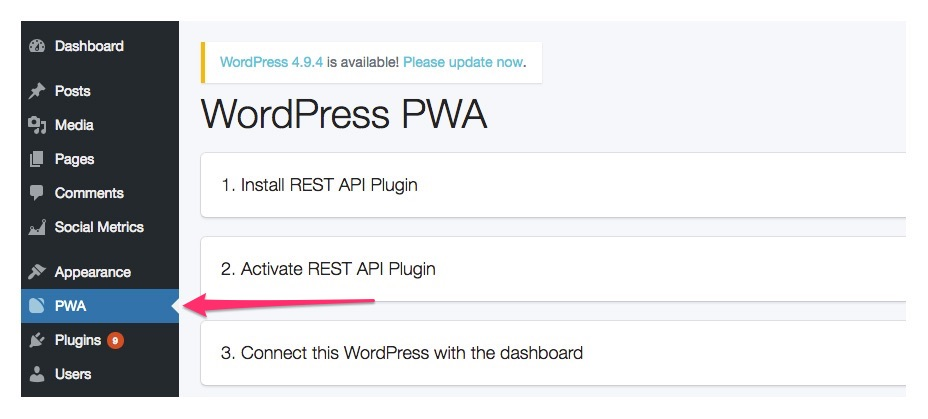
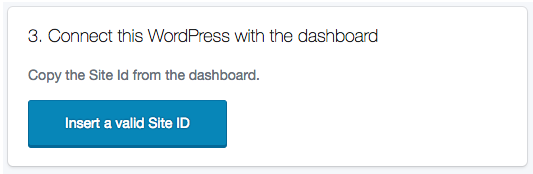

# Installation guide

1. [**Install the WordPress PWA plugin**](wp-pwa-plugin-installation.md#1-install-and-activate-the-wordpress-pwa-plugin)
2. [**Add Frontity's injector**](wp-pwa-plugin-installation.md#2-add-frontitys-injector-in-your-wordpress-theme)
3. [**Enter Site ID**](wp-pwa-plugin-installation.md#3-enter-your-site-id)

## 1. Install and activate the WordPress PWA plugin

Go to the WordPress Plugin Directory to get the latest version of the [WordPress PWA plugin](https://wordpress.org/plugins/wp-pwa/). Then follow the steps below.

* Click the `Download` button to get a `.zip` file.



* Once the download is completed, log into your WordPress site and go to `Plugins` &gt; `Add new`.
* Click `Upload Plugin` and upload the previous `.zip` file.


> Alternatively, you can directly install our plugin from your WordPress Admin. Navigate on the left menu to `Plugins` &gt; `Add new`and search for "WordPress PWA" \(By WordPress PWA\). Then click the `Install Now` button.

* Once installed, remember to **Activate** the plugin. To do so, you can navigate to `Plugins` &gt; `Installed Plugins`, and then click on `Activate` the WordPress PWA plugin.



## 2. Add Frontity's injector in your WordPress theme

After installing and activating the WordPress PWA plugin:

* Navigate to `Appearance` &gt; `Editor` &gt; `Theme header (header.php)`.
* **Copy and paste** the following **code** on the `header.php` file of your current theme, right after the `<head>` tag:

  ```php
  <?php
  if (isset($GLOBALS['wp_pwa_path'])) {
  require( WP_PLUGIN_DIR . $GLOBALS['wp_pwa_path'] . '/injector/wp-pwa-injector.php');
  }
  ?>
  ```

* Click `Update File` to apply and save changes.

> ⚠️ **IMPORTANT**: Our injector must be the first script to load, please make sure no other scripts are inserted before ours.

## 3. Enter your Site ID

* Click the **PWA** button on the left menu of your WordPress dashboard to navigate to the plugin configuration screen.



* Go to Step 3 \("Connect this WordPress...\) and click the`Insert a valid Site ID` blue button.
* Enter the Site ID we previously gave you.



> If you don’t know which is the Site ID for your WordPress site, please contact us.

