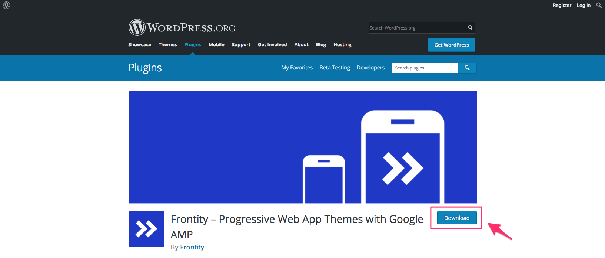
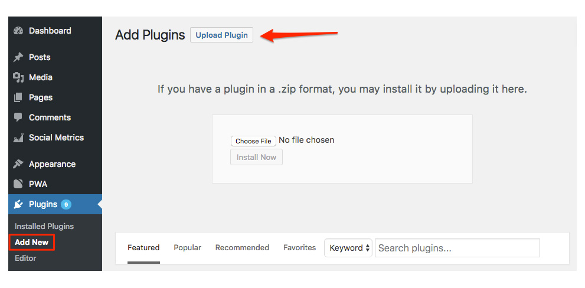
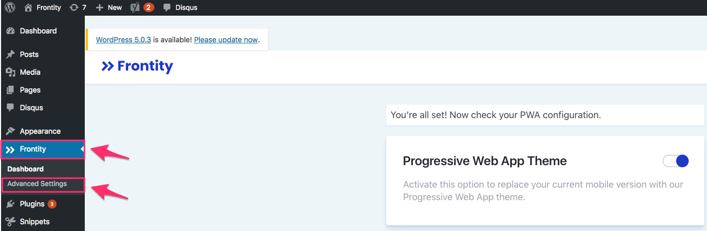
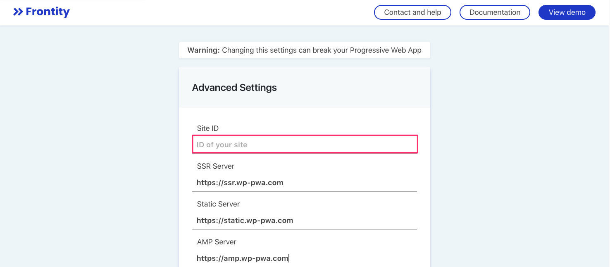

# Installation guide

* \*\*\*\*[**Install and activate Frontity's plugin**](https://support.frontity.com/getting-started/wp-pwa-plugin-installation#1-install-and-activate-frontitys-plugin)
* \*\*\*\*[**Enter your Site ID**](https://support.frontity.com/getting-started/wp-pwa-plugin-installation#2-enter-your-site-id)
* \*\*\*\*[**Add Frontity's injector**](https://support.frontity.com/getting-started/wp-pwa-plugin-installation#3-add-frontitys-injector-to-your-wordpress-theme)

## 1. Install and activate Frontity's plugin

Go to the WordPress Plugin Directory to get the latest version of [Frontity](https://wordpress.org/plugins/wp-pwa/). Then follow the steps below.

* Click the `Download` button to get a `.zip` file.



* Once the download is completed, log into your WordPress site and go to `Plugins` &gt; `Add new`.
* Click `Upload Plugin` and upload the previous `.zip` file.




> Alternatively, you can directly install our plugin from your WordPress Admin. Navigate on the left menu to `Plugins` &gt; `Add new` and search for "Frontity" \(By Frontity\). Then click the `Install Now` button.


* Once installed, remember to **Activate** the plugin. To do so, you can navigate to `Plugins` &gt; `Installed Plugins`, and then click on `Activate` Frontity's plugin.

## 2. Enter your Site ID

* Navigate to the **`Frontity`** menu item \(on your WordPress dashboard\) &gt; **`Advanced Settings`**.



* Once you're in the `Advanced Settings` screen, **enter the Site ID** we previously gave you.




If you don’t know which is the Site ID for your WordPress site, please contact us.


* Click **`Save changes`.**


## 3. Add Frontity's injector to your WordPress theme

After installing and activating Frontity's plugin:

* Navigate to `Appearance` &gt; `Editor` &gt; `Theme header (header.php)`.
* **Copy and paste** the following **code** on the `header.php` file of your current theme, right after the `<head>` tag:  


  ```php
  <?php
  if (isset($GLOBALS['wp_pwa_path'])) {
  require( WP_PLUGIN_DIR . $GLOBALS['wp_pwa_path'] . '/injector/wp-pwa-injector.php');
  }
  ?>
  ```

* Click `Update File` to apply and save changes.




**Important**: Our injector must be the first script to load, please make sure no other scripts are inserted before ours.


