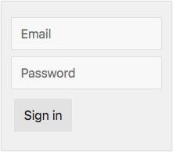

# Ad Configuration

Frontity allows you to insert ads in your website, between posts in post lists or within the content of posts or pages, being able to choose the position and order of these ads. 

Here you have a videotutorial with the steps to follow once you have sign in. If you need it, we have detailed each step of the process just after the video. If you have any troubles or comments please contact us at support@frontity.com

{% embed data="{\"url\":\"https://youtu.be/Euq1aF7F7Xw\",\"type\":\"video\",\"title\":\"How to create an ad in ads in ads-form.frontity.io\",\"description\":\"Let\'s see how to create an ad and define its placement in https://ads-form.frontity.io.\\n\\nFor more info, please visit our installation guide:\\n→ https://support.frontity.com/integrations/ads\",\"icon\":{\"type\":\"icon\",\"url\":\"https://www.youtube.com/yts/img/favicon\_144-vfliLAfaB.png\",\"width\":144,\"height\":144,\"aspectRatio\":1},\"thumbnail\":{\"type\":\"thumbnail\",\"url\":\"https://i.ytimg.com/vi/Euq1aF7F7Xw/mqdefault.jpg\",\"width\":320,\"height\":180,\"aspectRatio\":0.5625},\"embed\":{\"type\":\"player\",\"url\":\"https://www.youtube.com/embed/Euq1aF7F7Xw?rel=0&showinfo=0\",\"html\":\"
<iframe src=\\\"https://www.youtube.com/embed/Euq1aF7F7Xw?rel=0&amp;showinfo=0\\\" style=\\\"border: 0; top: 0; left: 0; width: 100%; height: 100%; position: absolute;\\\" allowfullscreen scrolling=\\\"no\\\"></iframe>
\",\"aspectRatio\":1.7778}}" %}

##  {#next-steps}

1. Go to [https://ads-form.frontity.io/](https://ads-form.frontity.io/) and **sign in** with your username and password

2.  **Select the site** where you want to create an ad

3. At the bottom of the form, you should press the _"**Create Ad"**_  ****button.


Remember you can create as many ads as you want


4. **Define a name** for the ad and **click the configuration icon**. 

5. First, select your ad server from the dropdown menu _**"Ad Server"**_. And then, define the required properties for the ad. \(For example, if you use AdSense you must fill in the client, slot, width, height\).


To know where to find the ad properties you can check out the following links: [**Adsense**](https://support.frontity.com/~/edit/drafts/-LNuf3OdVuhGlDZ2knQ1/integrations/ads/adsense), [**Smart AdServer**](https://support.frontity.com/~/edit/drafts/-LNuf3OdVuhGlDZ2knQ1/integrations/ads/smart-adserver), [**Doubleclick**](https://support.frontity.com/~/edit/drafts/-LNuf3OdVuhGlDZ2knQ1/integrations/ads/doubleclick). At the moment, we only support these ad servers.


6. Click the _**"Add Placement"**_  blue button to specify where you would like to display your ad. Once you have done that, you have to configure the placement.

* **6.1** Select from the dropdown menu where you want to place the ad \(list of posts, single, gallery or custom post type\) and then the specific page type/s. Please refer to the table below for more details about each page type.

|  | Page type | Explanation |
| :--- | :--- | :--- |
| **List of posts** | Latest posts | Ad is placed in the homepage |
|  | Categories | Ad is placed in all category pages |
|  | Tags | Ad is placed in all tag pages |
| **Single** | Post | Ad is placed in all the posts |
|  | Page | Ad is placed in all the pages |
| **Gallery** | Media | Ad is placed in galleries |
| **Custom post type** | Custom post type | Ad is placed in custom-post-type. Add the names separated by commas |

* **6.2** Once you have selected the page types where your ads will be placed, you must specify their position in the next dropdown menu.


You can add as many placements as you want by clicking again the blue "_**Add Placement"**_ button.


7. Once you have finished, remember to **SAVE** all changes


**Important**: please note that we place our ad between your first and second ad in each view, except for galleries. For more info, see our [business model](../../useful-information/business-model.md#our-business-model).


