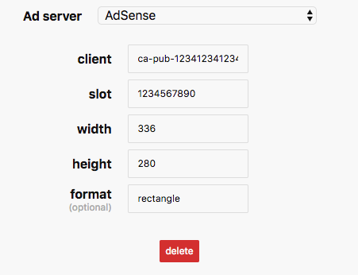

# AdSense

## Ad unit properties

| Parameter name | description | required |
| :--- | :--- | :--- |
| client | data-ad-client | yes |
| slot | data-ad-slot | yes |
| width | width of the ad unit | yes |
| height | height of the ad unit | yes |
| format | data-ad-format | no |

## Where to find your ad properties

For the example above, values for the properties are:

