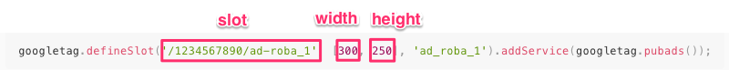
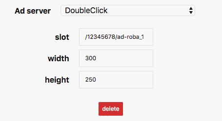

# DoubleClick

### Ad unit properties

| Parameter | description | required |
| :--- | :--- | :--- |
| **slot** | Full path of the ad unit with the network code and unit code. | yes |
| **width** | Width of the ad unit. | yes |
| **height** | Height of the ad unit. | yes |

## Where to find your ad properties

In the code generated by DoubleClick you can find the required values where the `googletag.defineSlot`function are used.

For the example above, values for the properties are:

