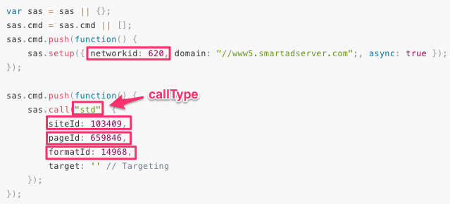

# Smart AdServer

## Ad account properties

| Parameter name | description |
| :--- | :--- |
| networkId | ID of the network \(account\) at Smart AdServer. |

## Ad tag properties

| Parameter name | description |
| :--- | :--- |
| siteId | Identifies the website. |
| pageId | Identifies the page on the website. |
| formatId | Identifies the format \(medium rectangle, skyscraper, etc.\) |
| callType | The type of call used to get the ad. Possible values are `std` and `iframe`. ¹ |
| width | Width of the ad unit. |
| height | Height of the ad unit. If `callType` is `std`, this value will be the minimum height. |

1\)`iframe` is safer, but can't be used with the `dynamic-height` option or with "Rich Media Templates". In `std`, an ad could take control of the whole DOM and manipulate it.

## Where to find your ad properties



```text
networkId: 620
```

```text
name: ad-medium-rectangle-1 (for example)
callType: 'std'
siteId: 103409
pageId: 659846
formatId: 14968
width: 300
height: 250
```

