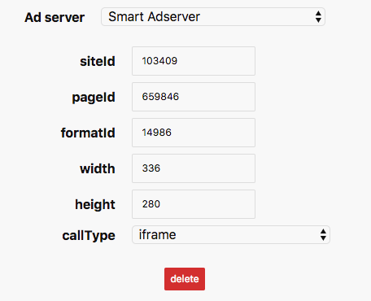

# Smart AdServer

If you are using Smart AdServer, please remember that you have to provide us your **networkId** as well, the ID of the account at Smart AdServer.

## Ad unit properties

| Parameter name | description | required |
| :--- | :--- | :--- |
| siteId | Identifies the website. | yes |
| pageId | Identifies the page on the website. | yes |
| formatId | Identifies the format \(medium rectangle, skyscraper, etc.\) | yes |
| width | Width of the ad unit. | yes |
| height | Height of the ad unit. If `callType` is `std`, this value will be the minimum height. | yes |
| callType | The type of call used to get the ad. Possible values are `std` and `iframe`.  | yes |


`iframe` is safer, but can't be used with the `dynamic-height` option or with "Rich Media Templates". In `std`, an ad could take control of the whole DOM and manipulate it.


## Where to find your ad properties

For the example above, values for the properties are:

