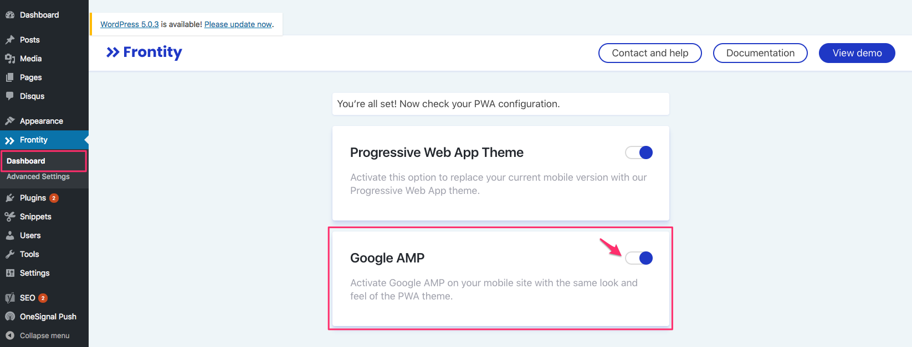

# Google AMP


**Important**: if you have any other Google AMP plugins for WordPress, please note that they will have to be deactivated before taking any of the following steps.


To enable Google AMP once your Progressive Web App has been configured, follow these steps:

1. Go to **Dashboard** screen of Frontity plugin from your WordPress dashboard.
2. You will find the **Google AMP** option on the screen, **enable** it.


Styling and layout is the same on both AMP pages and the Progressive Web App.


