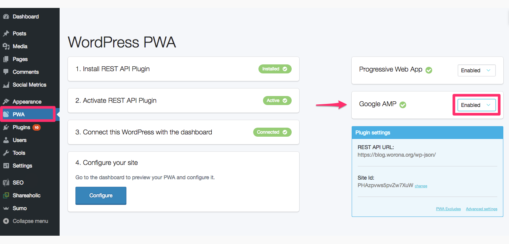

# Google AMP

> **⚠️ Important:** if you have any other Google AMP plugins for WordPress, please note that they will have to be deactivated before taking any of the following steps.

How to enable Google AMP on your site once your Progressive Web App has been configured:

1. Go to the **PWA configuration screen** from your WordPress dashboard.
2. You will find the **Google AMP** option on the right side of the screen.
3. Click on the drop down menu and select the **Enabled** option.

Styling and layout is the same on both AMP pages and the Progressive Web App.

