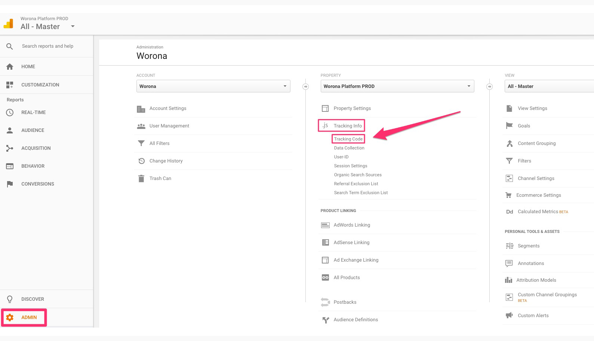
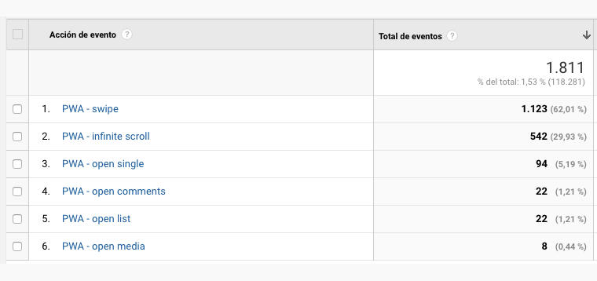

# Google Analytics

If you want to track traffic and users' interactions with the Progressive Web App, you can connect your Google Analytics account to the WordPress PWA plugin.

To do so, you will need to provide us with your **Analytics tracking ID**. If you don't know where to find this number, please keep reading. Otherwise, you can directly jump to the [Analytics events](./#our-analytics-events) section below.

## Where to find your Analytics tracking ID

First, go to [google.com/analytics](https://www.google.com/analytics/) to sign in. If you don't have an Analytics account, please create one.

Then, follow the next steps:

1. Click `Admin` at the bottom on the left menu.

2. Select your account from the drop down menu in the Account column.

3. In the **Property column**, select the property you want to link to our plugin and click on `Tracking Info` &gt; `Tracking Code`.

4. There you will find your **tracking ID**, a string like **UA-000000-2** that tells Analytics which account and property to send data to. Copy that number and send it out to us.

## Our analytics events

The WordPress PWA plugin use events to collect data about interactions with your content and the PWA. They will help you understand the behaviour of your visitors.

Our events have the following components:

* **Category**: the name for the object we're tracking.
* **Action**: a string that is paired with a category, and commonly used to define the type of user interaction for the object.
* **Label**: an optional string to provide additional dimensions to the event data.

All collected data is directly sent to your Analytics account. You can find it on `Behavior` &gt; `Events` &gt; `Overview` or `Main Events`.

All the **components** \(categories and actions\) of our events are always **prefixed** with `PWA -` \(see screenshot below\):

In order to understand your Analytics reports, please check out the **full list of our events** and their description [**here**](google-analytics-events.md).

