# Events

* [Menu](google-analytics-events.md#category-menu)
  * `activate notifications`
  * `deactivate notifications`
  * `open list`
  * `open single`
* [Share modal](google-analytics-events.md#category-share-modal)
  * `share`
* [Share bar](google-analytics-events.md#category-share-bar)
  * `share`
  * `open share modal`
  * `next`
* [Post bar](google-analytics-events.md#category-post-bar)
  * `open menu`
  * `close single`
* [List bar](google-analytics-events.md#category-list-bar)
  * `open menu`
  * `go home`
  * `activate notifications`
* [Media bar](google-analytics-events.md#category-media-bar)
  * `open menu`
  * `close media`
* [List](google-analytics-events.md#category-list)
  * `open share modal`
  * `open single`
  * `swipe`
* [Post](google-analytics-events.md#category-post)
  * `swipe`
  * `infinite scroll`
  * `open media`
  * `open comments`
  * `open list`
  * `open single`
* [Media](google-analytics-events.md#category-media)
  * `swipe`
* [Navbar](google-analytics-events.md#category-navbar)
  * `open single`
  * `open list`
* [Cookies](google-analytics-events.md#category-cookies)
  * `close`

## Category: Menu

This category refers to the Menu object \(highlighted in pink in the screenshot below\).

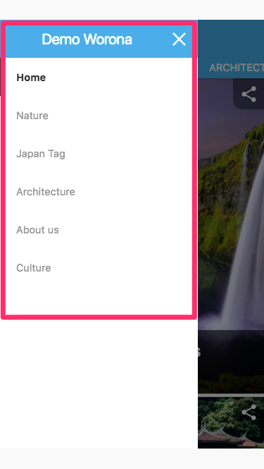

The **actions** that are paired with the **Menu** category are:

* **`activate notifications:`**

  User has activated notifications using the side menu.

* **`deactivate notifications:`**

  User has deactivated notifications using the side menu.

* **`open list:`**

  User has clicked a link in the side menu that will open a list.

* **`open single:`**

  User has clicked a link in the side menu that will open a post or page.

## Category: Share modal

This category refers to the Share modal object.

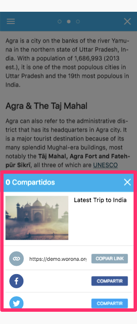

The **action** that is paired with the **Share modal** category is:

* **`share:`**

  User has shared a link using the share modal.

> This event also has the **label** `method`, which provides additional information on how the user shared that content \(by email, social networks, WhatsApp, etc\).

## Category: Share bar

This category refers to the Share bar object.

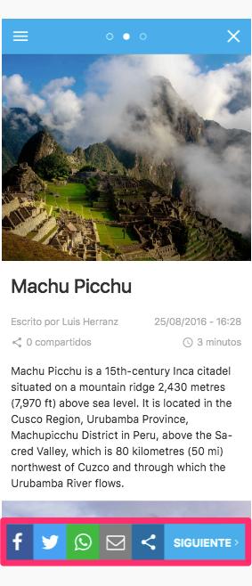

The **actions** that are paired with the **Share bar** category are:

* **`share:`**

  User has shared a link using the share bar.

> This event also has the **label** `method`, which collects data about the way the user shared that content \(via email, social networks, WhatsApp, etc\).

* **`open share modal:`**

  User has opened the share modal using the share bar.

* **`next:`**

  User has clicked in the Next button in the share bar.

## Category: Post bar

This category refers to the Post bar object.

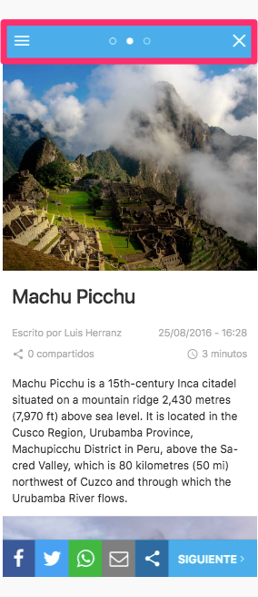

The **actions** that are paired with the **Post bar** category are:

* **`open menu:`**

  User has opened the side menu while in the Post view.

* **`close single:`**

  User has moved back to a list closing the current view.

## Category: List bar

This category refers to the List bar.

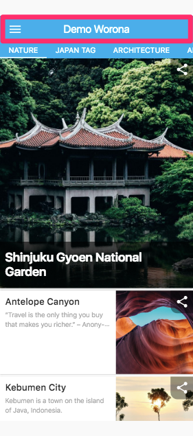

The **actions** that are paired with the **List bar** category are:

* **`open menu:`**

  User has opened the menu while in the List view.

* **`go home:`**

  User has moved to home clicking on the site logo.

* **`activate notifications:`**

  User has activated notifications using the List bar button.

## Category: Media bar

This category refers to the Media bar object.

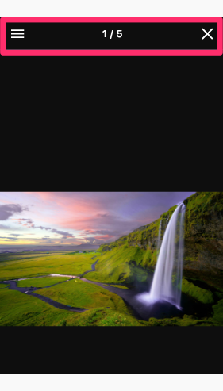

The **actions** that are paired with the **Media bar** category are:

* **`open menu:`**

  User has opened the menu while in the Media view.

* **`close media:`**

  User has moved back to a post closing the current view.

## Category: List

This category refers to the List object.

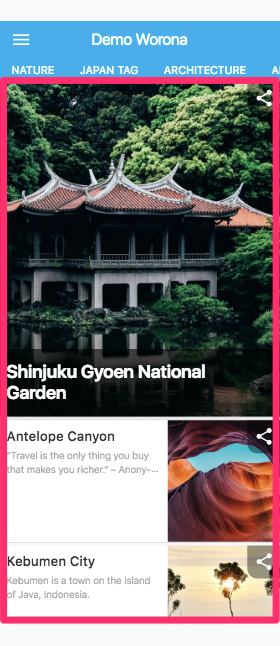

The **actions** that are paired with the **List** category are:

* **`open share modal:`**

  User has opened the share modal using the corner buttons in List view.

* **`open single:`**

  User has opened a post from List view.

* **`swipe:`**

  User has swiped between lists in List view.

## Category: Post

This category refers to the Post object.

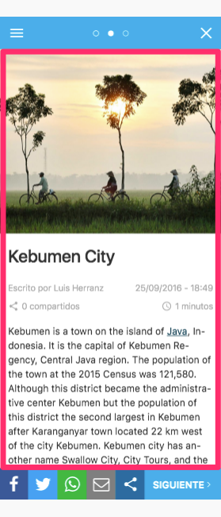

The **actions** that are paired with the **Post** category are:

* **`swipe:`**

  User has swiped between posts in Post view.

* **`infinite scroll:`**

  User has reached another item using infinite scroll.

* **`open media:`**

  User has opened a gallery in a post.

* **`open comments:`**

  User has opened the comments in a post.

* **`open list:`**

  User has opened a list clicking on the category tags.

* **`open single:`**

  User has opened a post clicking on a carousel.

## Category: Media

This category refers to the Media object.

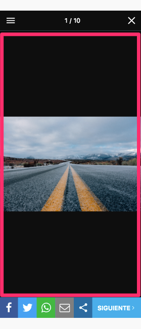

The **action** that is paired with the **Media** category is:

* **`swipe:`**

  User has swiped between images in a Media view.

## Category: Navbar

This category refers to the Navbar object.

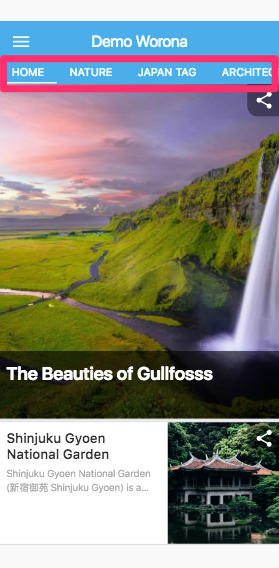

The **actions** that are paired with the **Navbar** category are:

* **`open single:`**

  User has clicked a link in the navbar that will open a post or page.

* **`open list:`**

  User has clicked a link in the navbar that will open a list.

## Category: Cookies

This category refers to the Cookies object.

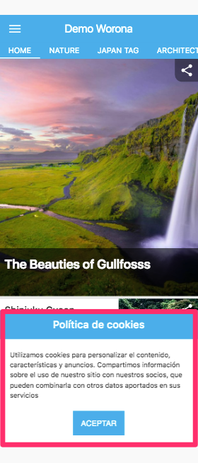

The **action** that is paired with the **Cookies** category is:

* **`close:`**

  User has accepted the cookies modal.

