# Google Tag Manager

* [**Introduction**](./#introduction)
* [**Create a new container**](./#create-container)
* [**Install Universal Analytics**](./#install-ua)
* [**Next steps**](./#next-steps)

## Introduction {#introduction}

If you want to use **Google Tag Manager** \(**GTM**\) to manage your analytics services, here you can find how to integrate it with our GTM events.

Our PWA currently supports the following types of events:

* [**Virtual Pageviews**](google-tag-manager-pageviews.md)
* [**Virtual Events**](google-tag-manager-events.md)

For us to be able to assume what your GTM container looks like while following this guide, you'll need to **create a new GTM container** from zero and install **Universal Analytics** \(**UA**\) as indicated in this guide. This way, you'll avoid interferences between the PWA configuration and any other setup you may have in your GTM. However, if you know what you are doing, feel free to integrate it in the way that better suits your needs.

## Create a new container {#create-container}

1. In the **accounts** view of your GTM, click the menu button for the account you want to use, and then click **Create Container**.

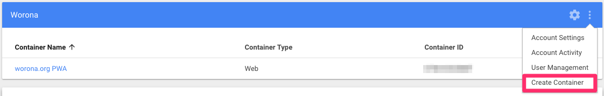

2. Now type a name for your container in the field under the label **Container name**, choose **Web** in the **Where To Use Container** option and click the **CREATE** button.

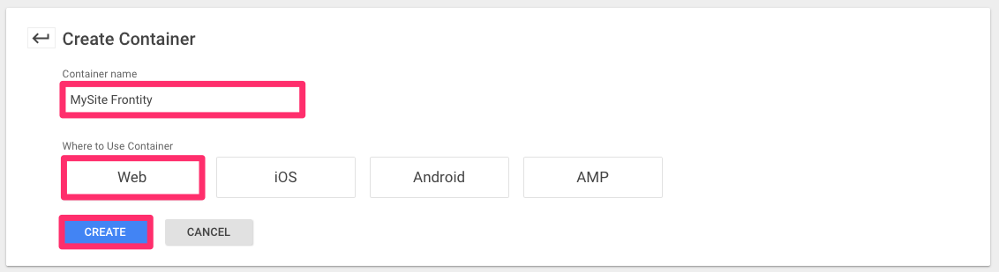

3. You'll see now a modal telling you how to install GTM on your site. You shouldn't worry about this, as Frontity is taking care of it for you. Click the **OK** button to finish the container creation process.

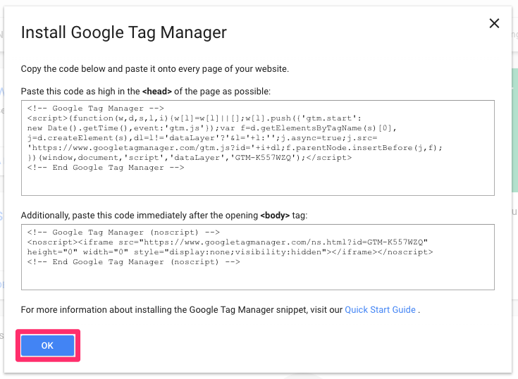

## Install Universal Analytics {#install-ua}

Now that you have your new GTM container, you'll need to install **Universal Analytics**. For that, follow these steps:

1. Create a new **variable** clicking on the **Variables** button in the side menu and then on the **NEW** button in the **User-Defined Variables** panel.

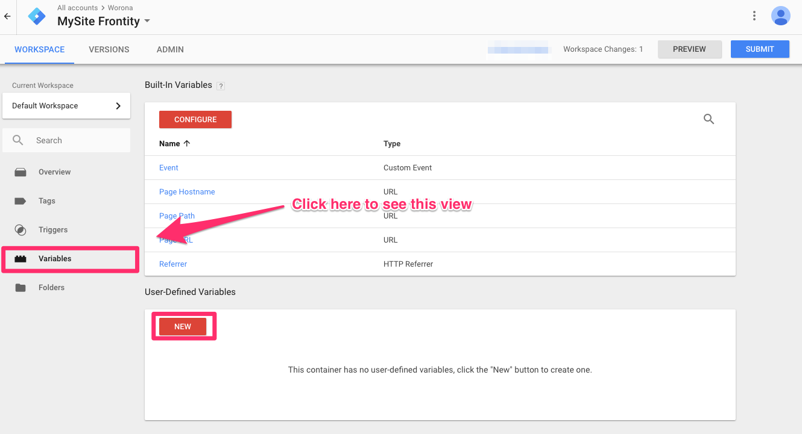

2. Name your variable and click the big button above the **Choose a variable type to begin setup...** label.

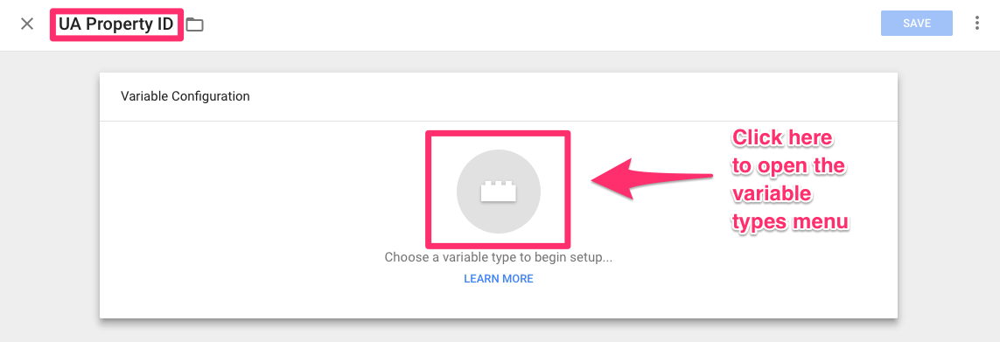

3. Choose the **Constant** type.

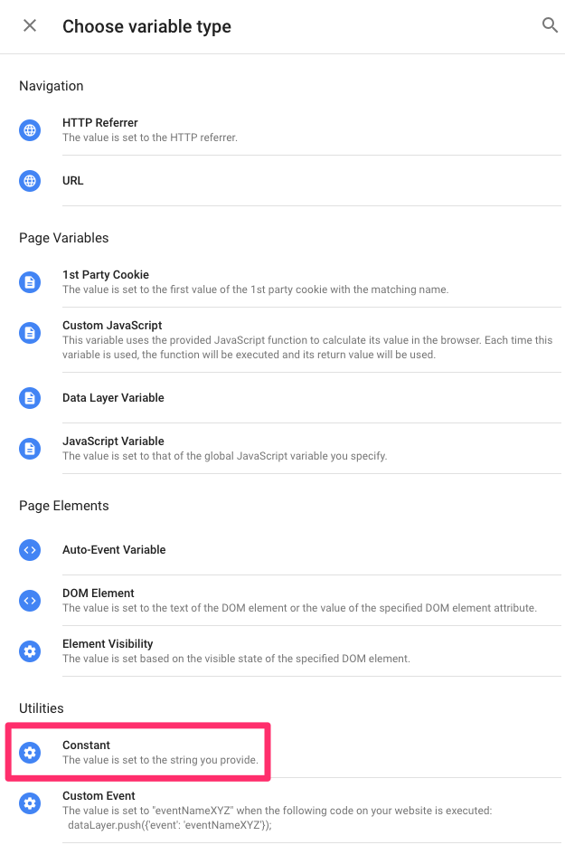

4. Type your **UA Property ID** in the **Value** field and click the **SAVE** button.

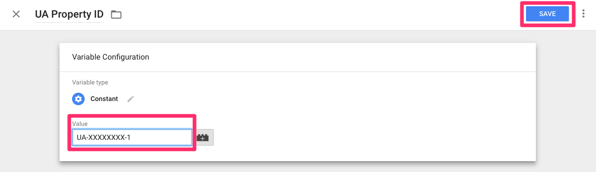

5. Now create a new **tag** clicking on the **Tags** button in the side menu and then on the **NEW** button.

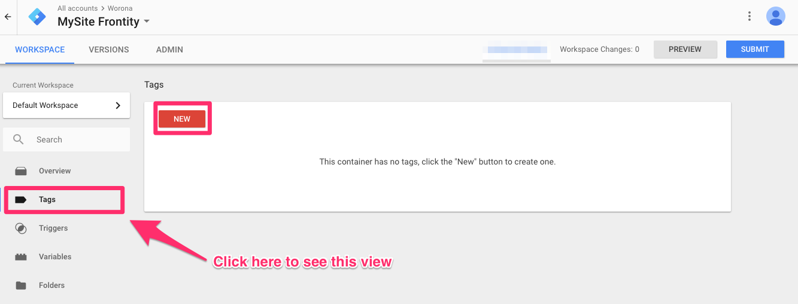

6. Name your tag and click the big button above the **Choose a tag type to begin setup...** label.

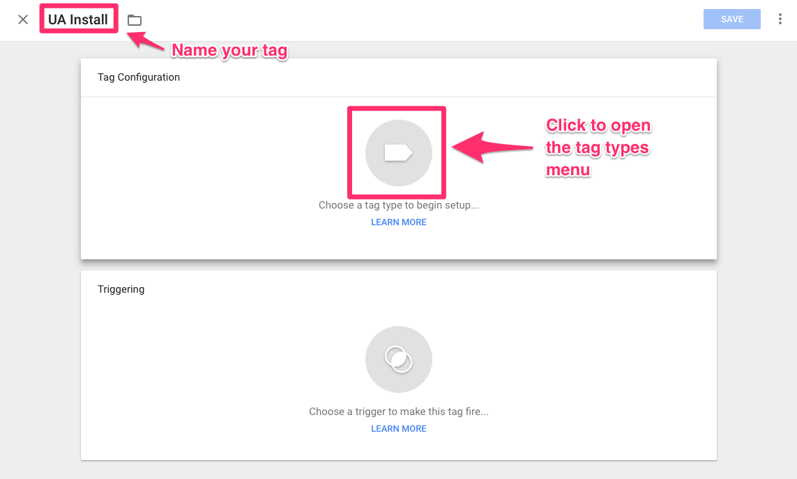

7. Choose the **Custom HTML** type.

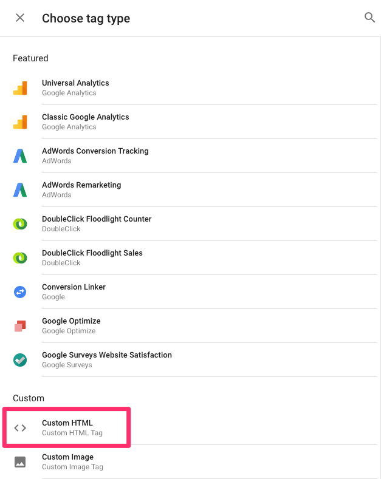

8. Copy and paste in the **HTML** field the following snippet:

```javascript
<script>
  (function(i,s,o,g,r,a,m){i['GoogleAnalyticsObject']=r;i[r]=i[r]||function(){
  (i[r].q=i[r].q||[]).push(arguments)},i[r].l=1*new Date();a=s.createElement(o),
  m=s.getElementsByTagName(o)[0];a.async=1;a.src=g;m.parentNode.insertBefore(a,m)
  })(window,document,'script','https://www.google-analytics.com/analytics.js','ga');

  ga('create', {{UA Property ID}}, 'auto', 'mySite');
  ga('mySite.set', 'checkProtocolTask', null);
  ga('mySite.set', 'transportUrl', 'https://www.google-analytics.com/collect');
</script>
```

As you can see in the snippet above, there are three places where you can find the string `mySite`. You should replace this string with your site's name. For example, in our case instead of `mySite` and `mySite.set` we would write `frontity` and `frontity.set`.

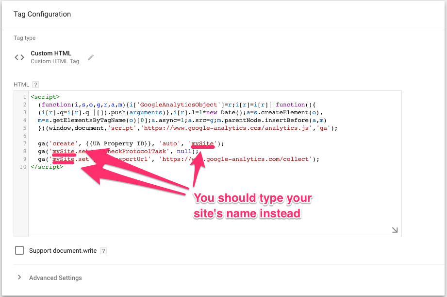

9. Click **Advanced Settings**. Then click the **Tag firing options** dropdown menu and choose the _Once per page_ option.

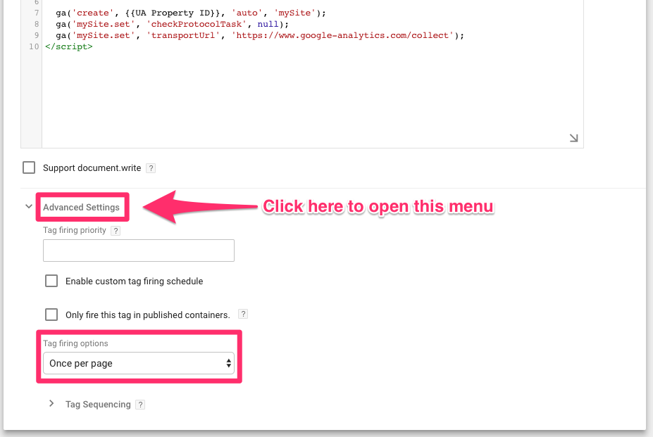

10. Click the big icon above the **Choose a trigger to make this tag fire...** label.

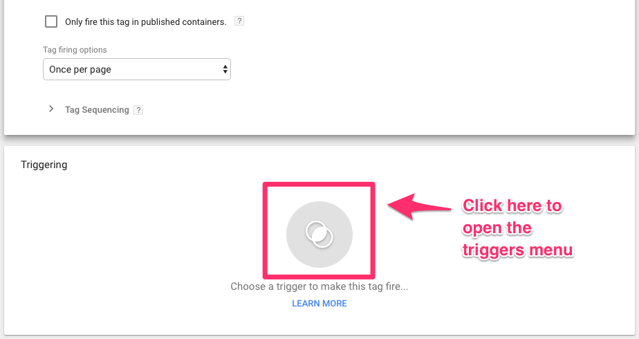

11. Choose the **All Pages** trigger.

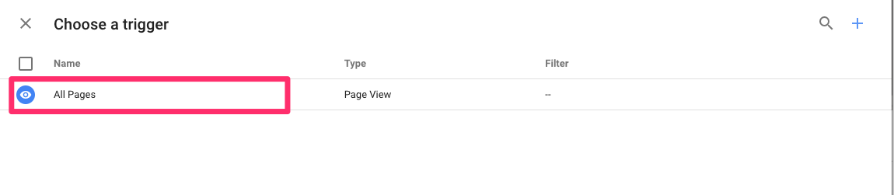

12. Click the **SAVE** button.

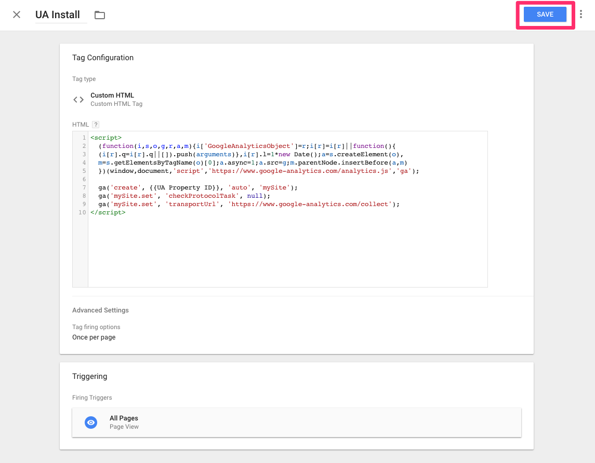

Now you have installed Universal Analytics in your GTM container.

## Next steps {#next-steps}

Now that you have your new container and Universal Analytics installed, you'll have to configure them to work with our GTM events:

* [**Virtual Pageviews**](google-tag-manager-pageviews.md)
* [**Virtual Events**](google-tag-manager-events.md)

