# Virtual Events

Our events' data is stored as part of the **Data Layer** object.

> A data layer is an object that contains all of the information that you want to pass to Google Tag Manager. [External link](https://developers.google.com/tag-manager/devguide#adding-data-layer-variables-to-a-page)

In order to use it you will have to create three elements in your GTM:

* [A **variable**](google-tag-manager-events.md#create-variable)
* [A **trigger**](google-tag-manager-events.md#create-trigger)
* [A **tag**](google-tag-manager-events.md#create-tag)

**NOTE:** This guide assumes that you already have your analytics service installed in your GTM.

## Create a variable {#create-variable}

A **variable** is the first element you need to create in GTM so you have a reference to the event data set by Frontity. Its creation is explained in the following steps:

1. After accessing your GTM, click the **Variables** button on the left side menu and click the **NEW** button below the **User-Defined Variables** label.

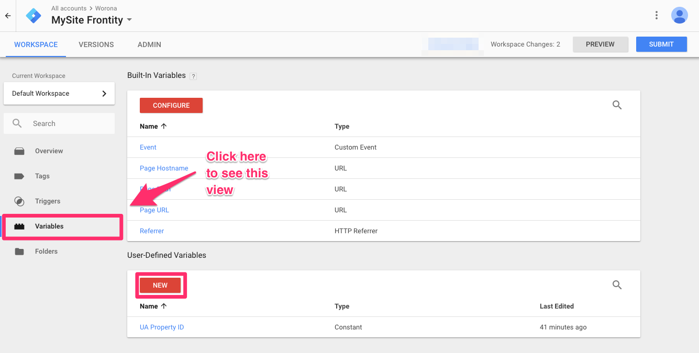

2. Name the variable and click the big icon above the **Choose a variable type to begin setup...** label.

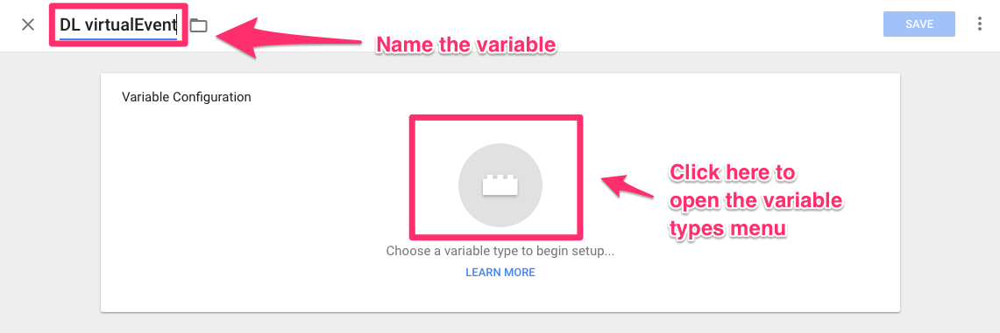

3. Now click the **Data Layer Variable** type.

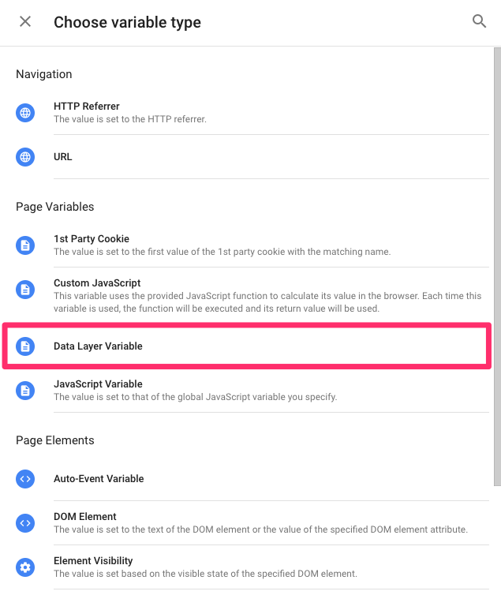

4. Type `virtualEvent` in the **Data Layer Variable Name** field and click the **SAVE** button to finish the variable creation.

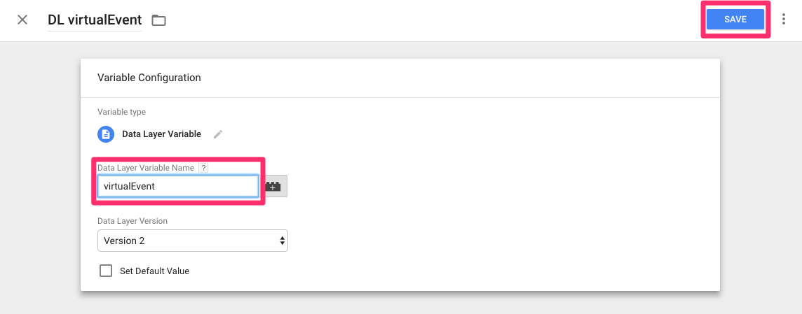

## Create a trigger {#create-trigger}

A **trigger** is the second element you need to create in GTM and is the one that will cause your GTM **tag** to run and send the `event` to your analytics service. Its creation is explained in the following steps:

1. Click the **Triggers** button on the left side menu and click the **NEW** button.

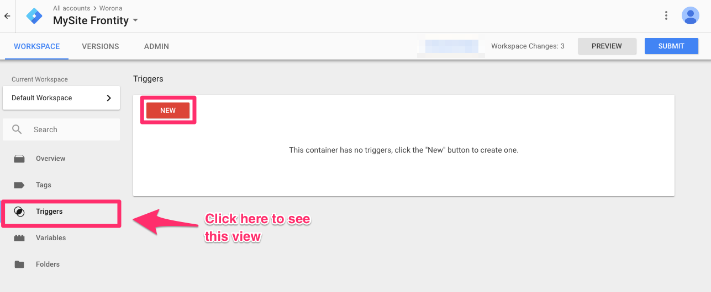

2. Name the new trigger and click the big icon above the **Choose a trigger type to begin setup...** label.

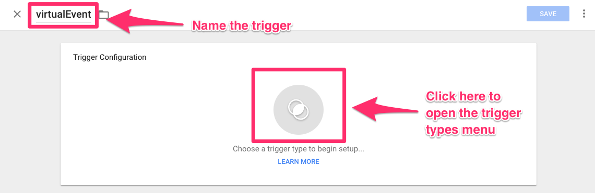

3. Now click the **Custom Event** type.

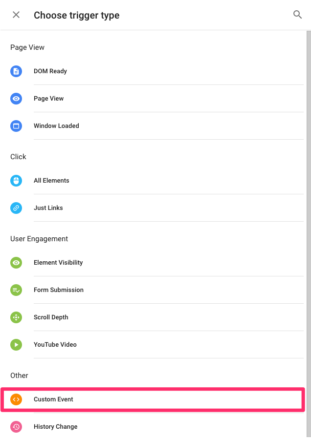

4. Type `virtualEvent` in the **Event Name** field and click the **SAVE** button to finish the trigger creation.

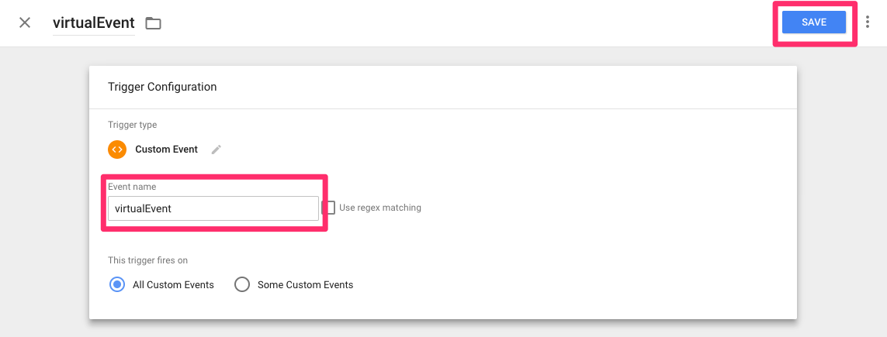

## Create a tag {#create-tag}

A **tag** is the last element you need to create in GTM so you can send the `event` to your analytics service.

We'll explain how to create a **tag** to send the `event` to your Google Analytics:

1. Click the **Tags** button on the left side menu and then click the **NEW** button.

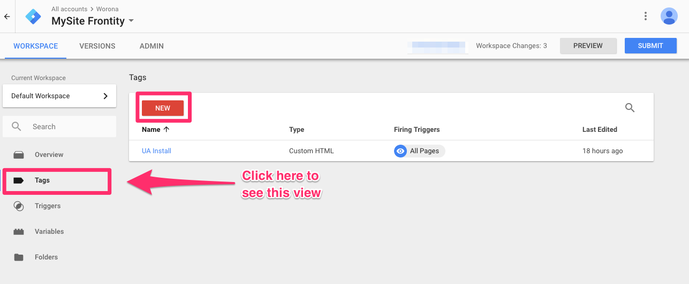

2. Name the new tag and then click the big icon above the **Choose a tag type to begin setup...** label.

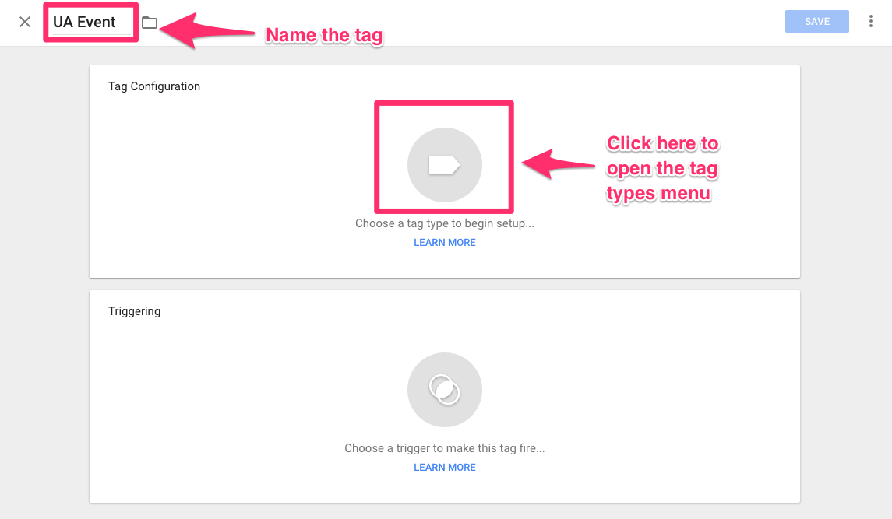

3. Now click the **Custom HTML** type.

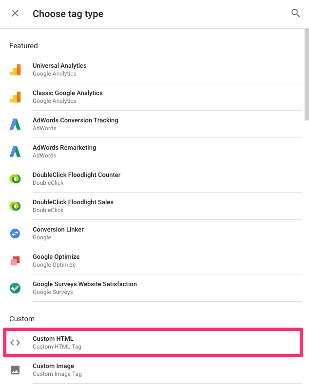

4. Copy and paste the following snippet inside the **HTML** field.

```javascript
<script>
  if (typeof window.ga === 'function')
    ga('mySite.send', 'event', {
      eventCategory: {{DL virtualEvent}}.category,
      eventAction: {{DL virtualEvent}}.action,
      eventLabel: {{DL virtualEvent}}.label
    });
</script>
```

This code is using the fields `url` and `title` that are stored in the Data Layer. You are accessing them with the GTM variable `{{DL virtualEvent}}` \(the one you created before\). If you gave a different name to this variable, that's the name you'll have to type inside the brackets \(respecting whitespace\).

Also, the `mySite` string in the snippet should be substituted by your site's name.

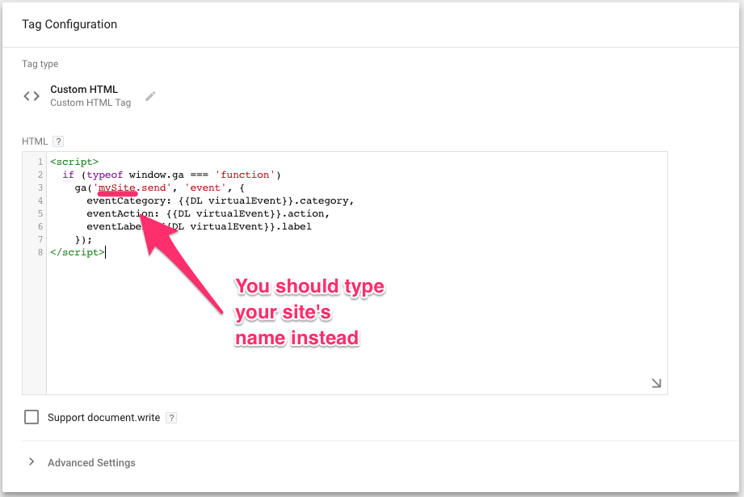

5. Now click the big icon above the **Choose a trigger to make this tag fire...** label.

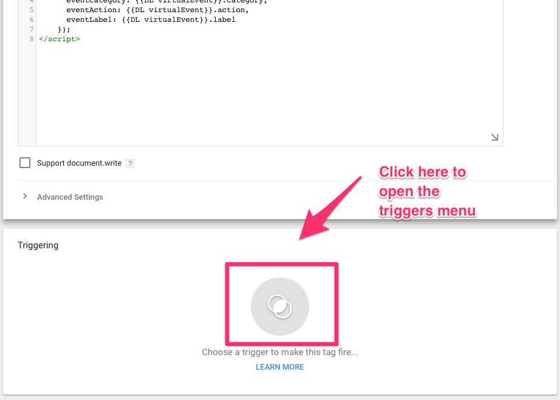

6. You should select the trigger created previously. In our case, that will be **virtualEvent**.

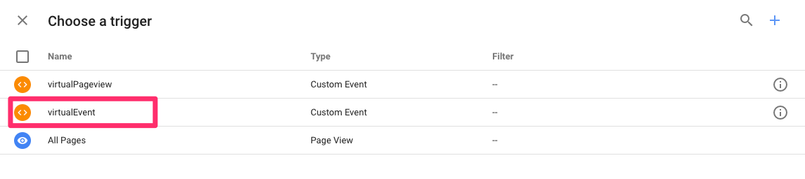

7. Finish the trigger creation by clicking on the **SAVE** button.

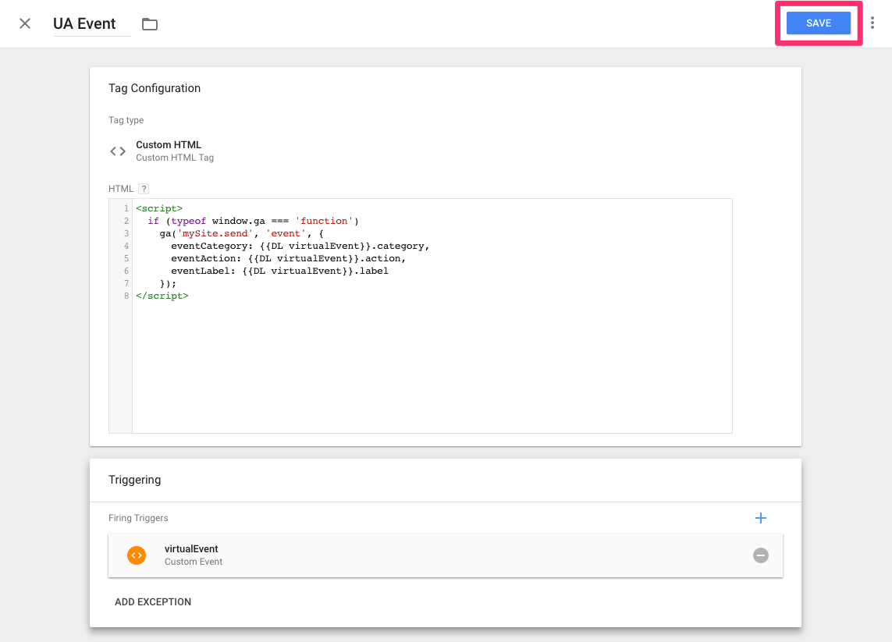

If you followed all the steps and submitted your GTM changes, you should already be receiving the mobile `events` in your Google Analytics.

