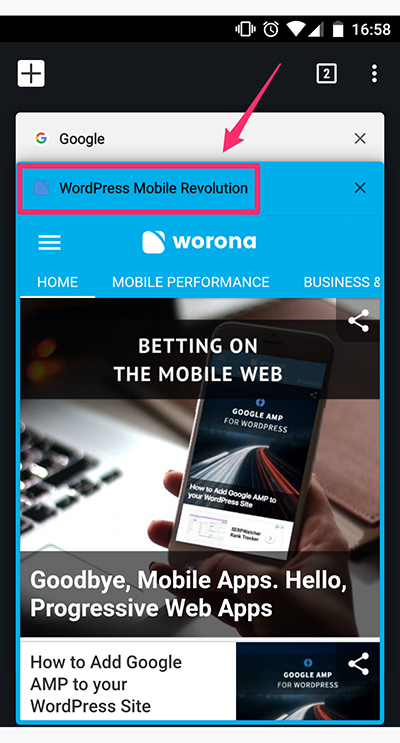

# Yoast SEO

Our PWAs are already integrated with Yoast SEO and other similar SEO plugins, so there's no need for you to install any additional plugins.

You should know, however, that there's a plugin called [Yoast SEO for WordPress PWA](https://wordpress.org/plugins/wp-pwa-yoast-seo/) which is only useful to display the proper page title of your site in the mobile browser \(see screenshot below\).

Its installation is **not mandatory** because it **does not have any impact** on your SEO ranking. The server side rendered version that is indexed by search engines does already have all the correct values.


**Important**: by contrast, this plugin might have an impact in the WordPress REST API of your site and make the PWA to load slower. We only recommend its installation under specific situations and when your REST API is cached. 


