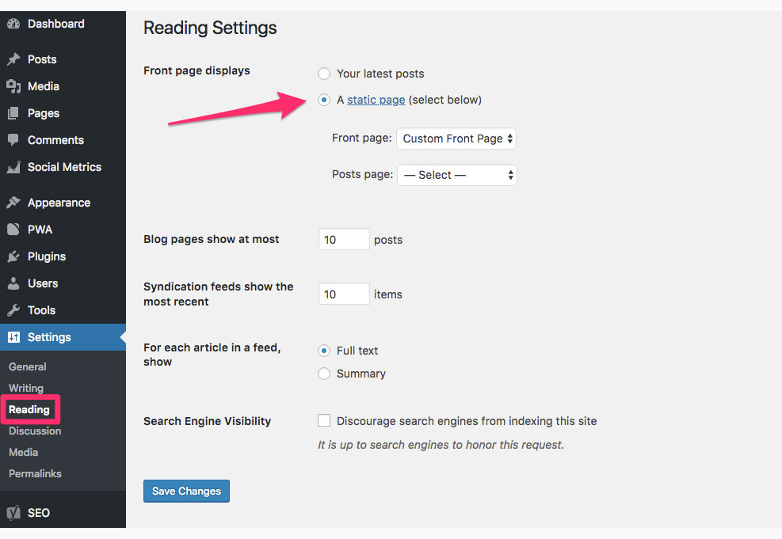
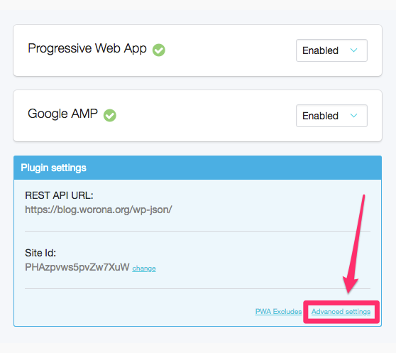
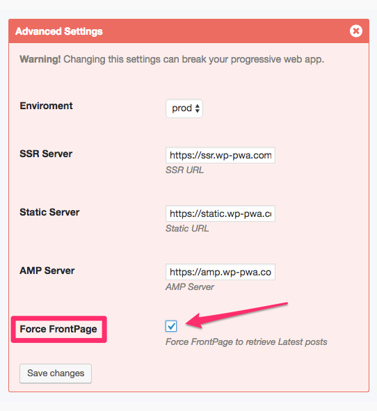

# Homepage is not displaying posts

By default the homepage of your Progressive Web App will always display the latest posts from your blog. For this reason, if you have set your front page to display a **static custom page** \(screenshot below\), the **PWA will not properly display it** in the homepage.

The solution here is quite simple. You don't need to change your front page, just follow these steps:

1. Go to the PWA configuration screen from your WordPress dashboard.  
2. In the blue **Plugin settings** box, click the **Advanced Settings** link.

3. Tick the **Force FrontPage** check box and then **Save changes**.

That's it. Now the homepage of the PWA will display again the latest posts from your blog.

