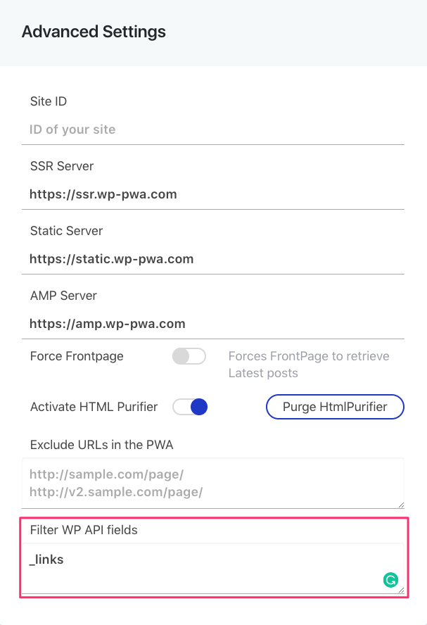

# How to filter WP REST API fields

If you don't want to show a specific field of the REST API, you can filter it in a very easy way following the next steps:


**Recommended:** It is useful to filter the field "\_links" to prevent Google Search Console from indexing links such as _https://mydomain.com/wp-json/wp/v2/categories/45_[.](https://test.frontity.io/wp-json/wp/v2/categories/) It usually generates warnings in the console that are unnecessary. 


1. Go to **Advanced Settings** screen of Frontity plugin from your WordPress dashboard.

2. In the settings box, go to **Filter WP API fields**, and **type or paste** the **fields** you want to filter \(one per line\).


_If you want to filter a nested field you have to use dot notation \(i.e: title.rendered\)_


3. Click **Save Changes**.

