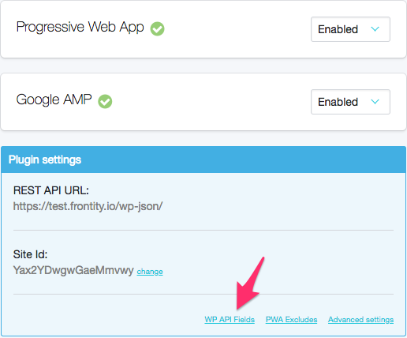
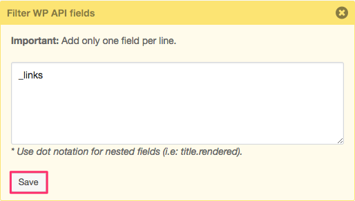

# How to filter WP REST API fields

If you don't want to show a specific field of the REST API, you can filter it in a very easy way following the next steps:


**Recommended:** It is useful to filter the field "\_links" to prevent Google Search Console from indexing links such as _https://mydomain.com/wp-json/wp/v2/categories/45_[.](https://test.frontity.io/wp-json/wp/v2/categories/) It usually generates warnings in the console that are unnecessary. 


1. Go to the **PWA configuration** screen from your WordPress dashboard.

2. In the blue **Plugin settings** box, click the **WP API Fields** link.

3. **Type or paste** the **fields** you want to filter \(one per line\).


_If you want to filter a nested field you have to use dot notation \(i.e: title.rendered\)_


4. Click **Save**.

