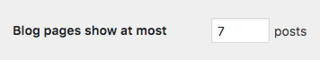

# How to purge WP REST API

If you are using a cache for WordPress and want to include the WP-API, you'll have to invalidate it when a post is published or edited.

This is the list of urls you need to invalidate when a **POST X** is published or edited:

## POST X:

[https://blog.com?rest\_route=/wp/v2/posts/**X**&\_embed=true    
](how-to-purge-wp-api.md)

### LATEST POST, from the page where POST X is located \(for example 3\):

[https://blog.com?rest\_route=/wp/v2/posts&\_embed=true&page=3&per\_page=10](how-to-purge-wp-api.md)  
[https://blog.com?rest\_route=/wp/v2/posts&\_embed=true&page=4&per\_page=10](how-to-purge-wp-api.md)  
[https://blog.com?rest\_route=/wp/v2/posts&\_embed=true&page=5&per\_page=10](how-to-purge-wp-api.md)  
and so on...

**Important:** The URL of the frontpage is  
[https://blog.com?rest\_route=/wp/v2/posts&\_embed=true&page=1&per\_page=10](how-to-purge-wp-api.md)

### CATEGORIES \(for example Y\) containing POST X, from the page where POST X is located \(for example 7\):

[https://blog.com?rest\_route=/wp/v2/posts&\_embed=true&**categories=Y**&page=7&per\_page=10](how-to-purge-wp-api.md)  
[https://blog.com?rest\_route=/wp/v2/posts&\_embed=true&**categories=Y**&page=8&per\_page=10](how-to-purge-wp-api.md)  
[https://blog.com?rest\_route=/wp/v2/posts&\_embed=true&**categories=Y**&page=9&per\_page=10](how-to-purge-wp-api.md)  
and so on...

### TAGS \(for example Z\) containing POST X, from the page where POST X is located \(for example 1\):

[https://blog.com?rest\_route=/wp/v2/posts&\_embed=true&page=1&per\_page=10&**tags=Z**](how-to-purge-wp-api.md)  
[https://blog.com?rest\_route=/wp/v2/posts&\_embed=true&page=2&per\_page=10&**tags=Z**](how-to-purge-wp-api.md)  
[https://blog.com?rest\_route=/wp/v2/posts&\_embed=true&page=3&per\_page=10&**tags=Z**](how-to-purge-wp-api.md)  
and so on...

Other useful considerations:

* If you are using _custom post types_ and we have activated the **auto-discover** feature, you need to substitute **?rest\_route=/wp/v2/posts&** for **/wp-json/wp/v2/posts?**. For example, the frontpage url would be: [https://blog.com**/wp-json/wp/v2/posts?**\_embed=true&page=1&per\_page=10](how-to-purge-wp-api.md)
* If you don't use 10 posts per page, you need to change all the **per\_page** queries. For example, if you WP is configured like this:  the frontpage url would be: [https://blog.com?rest\_route=/wp/v2/posts&\_embed=true&page=1&**per\_page=7**](how-to-purge-wp-api.md)
* If you edit **PAGE X**, the only url you need to purge is: [https://blog.com?rest\_route=/wp/v2/pages/**X**&\_embed=true](how-to-purge-wp-api.md)
* Query params are sorted alphabetically, starting with **\_embed**. For that reason **categories** go before **page** and **per\_page** but **tags** go after it:

  [https://blog.com?rest\_route=/wp/v2/posts&\_embed=true&**categories=Y**&page=3&per\_page=10](how-to-purge-wp-api.md)  
  [https://blog.com?rest\_route=/wp/v2/posts&\_embed=true&page=1&per\_page=10&**tags=Z**](how-to-purge-wp-api.md)

* When editing categories \(name, slug...\), tags \(name, slug...\) or authors \(name, description...\) we recommend to wipe out the entire WP-API cache as they can be included in many different queries, including custom ones.
* Media can also be included in many different queries. To avoid wiping out the entire cache, we recommend to delete the "wrong" image and upload a new one.

