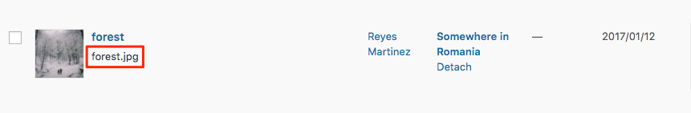

# Some images don't show up

Sometimes, some images don't show up on the Progressive Web App. This happens because the WP-API fails to retrieve the proper media object and it looks like this:

There are usually **two different reasons** why the WP-API fails to retrieve the proper media object. One less common than the other:

* Because the image contains special characters.
* Or because the image is attached to a post / page which changed its status.

Here's **how to sort this** issue in both cases.

## 1. An image contains special characters

If an image is not showing up on the PWA, it may happen because it contains special characters \(è, ñ, ß...\). This problem is less common as most servers treat special characters properly.

The solution here is to **delete** the file and **upload** it again, without any special character in the name.

## 2. Image is attached to a post / page that changed its status

This is the most common problem. When an image is uploaded for the first time while editing or creating a post, WordPress "attaches" it by default to that post. For example, this image \(_forest.jpg_\) was uploaded to the _"Somewhere in Romania"_ post, so it got attached to it.

If we **change** the _"Somewhere in Romania"_ post **to private**, we **delete it** or **change its status** from published **to draft**, the image \(_forest.jpg_\) won't appear in the WP REST API. Instead, you will see this error message

This means the PWA can't access that image anymore and is not able to display it.

### Solution: detach the image from any post / page

In order to address this problem, you will have to detach the image from any post or page:

1. Go to your WordPress dashboard and navigate on the left menu to `Media` **&gt;** `Library`.  
2. Switch to the **Media List view** using this button:

3. Find the image you would like to detach.  
4. **Click** where it says `Detach`, just below the name of the post / page:

Once detached, the WP REST API will retrieve the image and it will show up again on the PWA.


After detaching an image, you can re-attach it to another post if you want, but that's not mandatory.


